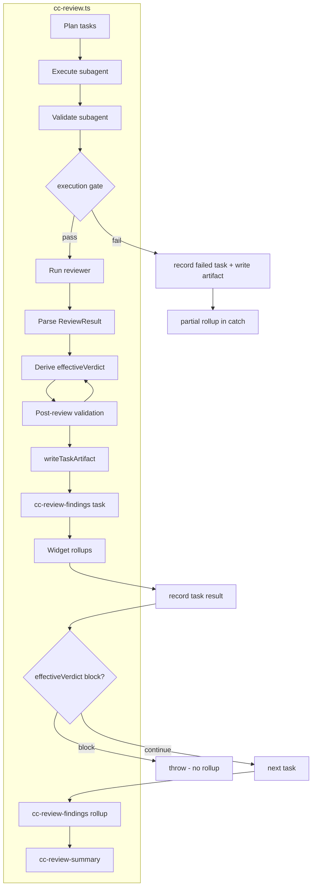

# Oh My Pi Lessons — Structured Review Design

**Status:** Approved design (brainstorming 2026-06-26)  
**Scope:** Phases 1–4 from `docs/oh-my-pi-lessons-implementation-spec.md`  
**Out of scope:** Phase 5 (role-based model routing), realtime advisor loop

## Summary

CC Review Orchestrator will move from prose-inferred decisions to schema-validated subagent reports and reviewer verdicts, with durable per-task artifacts and structured TUI surfaces. This design adopts an artifact-first skeleton (Phase 1 writes full v1 schema), a shared JSON parser module (last balanced object for subagent/reviewer), explicit reported vs effective verdict semantics, post-review validation after reviewer file fixes, and a three-surface display layer (live widget rollups, per-task + rollup `cc-review-findings` messages, enhanced `cc-review-summary`).

## Problem

The orchestrator loop (plan → execute → review → summarize) works, but critical decisions are inferred from free-form text:

- Subagent validation scans tokens (`todo:`, `failed to`, acceptance-criteria regex).
- Reviewer outcome relies on subprocess exit code and logs, not a typed verdict.
- Final report truncates subagent output (~500 chars) with no machine-readable task artifact.
- TUI shows severity-colored logs but no structured finding cards.

Oh-my-pi (`can1357/oh-my-pi`) demonstrates the target pattern: parent workflows consume schema-validated objects, not prose.

## Goals

- Persist complete per-task artifacts under run-isolated `cc-review-artifacts/<run-id>/` directories.
- Machine-readable subagent completion (JSON + text fallback).
- Machine-readable reviewer verdict and prioritized findings (JSON + exit-code fallback).
- Halt workflow on reviewer `block` (effective verdict), symmetric to execution gate.
- Post-review validation when reviewer applies fixes.
- Display: widget rollups, `cc-review-findings` (per-task + rollup), enhanced summary renderer.
- Incremental rollout compatible with existing generator agents and review providers.

## Non-Goals

- Realtime advisor loop replacing linear workflow.
- JSON-only reviewer (must still edit workspace files).
- Full TUI redesign before structured findings exist.
- Phase 5 model routing.
- New external services or mandatory dependencies.

## Architecture



### Layers

| Layer | Responsibility |
|---|---|
| Persistence | `cc-review-artifacts/<run-id>/task-NNN.json` — source of truth |
| Contracts | Subagent report + reviewer result JSON schemas |
| Workflow | Existing loop + execution gate + review gate |
| Display | Widget, `cc-review-findings`, `cc-review-summary` |

### Implementation strategy

**Artifact-first skeleton + shared parser modules** (recommended hybrid):

1. Phase 1: full `TaskArtifact` v1 schema with nullable structured fields.
2. Phase 2: `extractLastJsonObject`, `parseSubagentStructuredReport`, text fallback.
3. Phase 3: reviewer parse, `deriveEffectiveVerdict`, post-review validation, review gate halt.
4. Phase 4: display layer only (no contract changes).

## Data Contracts

### Subagent Final Report

Parse the **last** balanced JSON object from final assistant text via the shared helper `extractBalancedJsonObject(text, "last")` exported from `.pi/extensions/cc-review/structured.ts` (the planner path uses the same helper with `"first"`).

```json
{
  "status": "completed",
  "summary": "Implemented the requested change and verified it with tests.",
  "filesChanged": [".pi/extensions/cc-review.ts"],
  "unresolvedItems": [],
  "acceptanceCriteria": [
    {
      "criterion": "Workflow records full task output",
      "status": "met",
      "evidence": "Task artifacts are written under cc-review-artifacts/"
    }
  ]
}
```

| Field | Type | Required |
|---|---|---|
| `status` | `completed \| partial \| blocked` | yes |
| `summary` | string | yes |
| `filesChanged` | string[] | no |
| `unresolvedItems` | string[] | no |
| `acceptanceCriteria` | array of `{ criterion, status: met\|not_met\|unknown, evidence? }` | no |

**Structured validation:**

- Pass: `status: "completed"`, no `not_met`/`unknown` criteria, no unresolved items.
- Fail: `partial`, `blocked`, any `not_met`, unresolved items → `validation_failed` → execution gate halt.
- Fallback: no balanced JSON object or invalid JSON syntax → existing text-token validation; artifact `schemaParseStatus: "fallback_text"`.
- Invalid schema: syntactically valid JSON that resembles a subagent report but violates the contract does **not** fall back to text. Record `schemaParseStatus: "invalid_schema"` and fail the execution gate. This prevents malformed structured reports from bypassing validation through favorable prose.

### Reviewer Result

Reviewer inspects/fixes workspace files, then ends with one JSON object:

```json
{
  "verdict": "ship",
  "summary": "No blocking issues remain after review.",
  "findings": [
    {
      "priority": "P2",
      "confidence": 0.78,
      "file": ".pi/extensions/cc-review.ts",
      "message": "Artifact path should appear in final summary.",
      "status": "fixed"
    }
  ],
  "postFixValidation": {
    "status": "passed",
    "evidence": "Re-ran tests after patch."
  }
}
```

| Field | Type | Required |
|---|---|---|
| `verdict` | `ship \| ship_with_warnings \| block` | yes (when parsed) |
| `summary` | string | yes (when parsed) |
| `findings` | array | yes (may be empty) |
| `postFixValidation` | `{ status: passed\|failed, evidence? }` | required when any finding has `status: "fixed"` |

**Finding fields:** `priority` (P0–P3), `confidence` (0–1), `file?`, `line?`, `message`, `status` (`fixed \| unfixed \| not_applicable`).

**Schema parsing and unfixed P0/P1 definition:**

- Count only findings with `status: "unfixed"`.
- A fully valid result requires every finding field described above.
- If a syntactically valid reviewer object contains a recognizable P0/P1 finding but that finding has a missing, unknown, or wrongly typed `status`, preserve the recognizable finding, normalize its status to `unfixed`, set `reviewParseStatus: "invalid_schema"`, and block with `ambiguous_high_severity`.
- Other schema violations set `reviewParseStatus: "invalid_schema"` and use the conservative fallback rules below; they never become `parsed`.
- `fallback_exit_code` is used only when no candidate reviewer JSON object exists or JSON syntax is invalid. It is not used to turn a schema-invalid object into a successful review.

**Findings sort:** P0 → P1 → P2 → P3, then confidence descending within same priority.

### Reported vs Effective Verdict

| Field | Meaning |
|---|---|
| `reportedVerdict` | `verdict` from parsed reviewer JSON; `null` if unparseable |
| `effectiveVerdict` | Orchestrator-derived verdict used for halt, status, UI |
| `blockReason` | Present only when `effectiveVerdict === "block"` |

`blockReason` values:

- `explicit_block` — reported `block`
- `unfixed_high_severity` — unfixed P0/P1
- `ambiguous_high_severity` — P0/P1 with missing/unknown status treated as unfixed
- `post_review_validation_failed` — post-review validation failed

**Derivation order:**

1. Normalize P0/P1 missing/unknown status → unfixed.
2. Any unfixed P0/P1 → `effectiveVerdict = block` with appropriate `blockReason`.
3. Else `reportedVerdict === "block"` → `effectiveVerdict = block`, `blockReason = explicit_block`.
4. Else post-review validation fails → `effectiveVerdict = block`, `blockReason = post_review_validation_failed`.
5. Else `reviewParseStatus === "invalid_schema"` → `effectiveVerdict = ship_with_warnings`, `fallbackApplied = true`. A schema-invalid object can never produce `ship`.
6. Else `reviewParseStatus !== "parsed"` and `reviewerExitCode !== 0` → `effectiveVerdict = ship_with_warnings`, `fallbackApplied = true`.
7. Else unfixed P2/P3 only → `effectiveVerdict = ship_with_warnings`.
8. Else `effectiveVerdict = reportedVerdict ?? (reviewerExitCode === 0 ? "ship" : "ship_with_warnings")`.

**Non-zero exit + parseable `ship`:** task status remains `completed`, but artifact and summary record `reviewerExitCode` and a diagnostic line (`Reviewer exited non-zero (code N) despite ship verdict`). Diagnostics are never dropped.

### ProcessResult

Replace ambiguous `output` with explicit buffers:

```typescript
interface ProcessResult {
  exitCode: number;        // retain `code` alias during migration
  stdout: string;
  stderr: string;
  combinedOutput: string;  // chunks appended in arrival order (stdout + stderr interleaved)
}
```

JSON parsing uses `combinedOutput` and scans for the last balanced object.

### Verification Plan

```typescript
interface VerificationCommand {
  command: string;
  args: string[];
  timeoutMs?: number;
}
```

Resolution precedence:

1. Explicit `validationCommands` in the `cc_review` tool input.
2. Repository-owned `.cc-review-validation.json`.
3. No plan.

The configuration file contains `{ "commands": VerificationCommand[] }`. Configuration is schema-validated before task execution. Empty commands, non-string argv entries, invalid timeouts, and unknown top-level fields fail fast. The orchestrator does not execute shell command strings and does not accept validation commands from planner, subagent, or reviewer output.

### Task Artifact

Path: `<cwd>/cc-review-artifacts/<run-id>/task-NNN.json`

- Generate one filesystem-safe, collision-resistant `run-id` at workflow start (UTC timestamp plus random suffix).
- Never delete another run's files. Concurrent workflows therefore cannot overwrite or remove each other's artifacts.
- A task's artifact is written atomically (`.tmp` in the same run directory, then rename).
- Retention is explicit and separate from workflow startup; this increment does not automatically delete historical runs.

```json
{
  "schemaVersion": 1,
  "runId": "20260626T120000000Z-a1b2c3",
  "taskIndex": 0,
  "task": { "title": "", "description": "", "acceptanceCriteria": "" },
  "execution": {
    "exitCode": 0,
    "status": "completed",
    "rawOutput": "",
    "structuredReport": {
      "status": "completed",
      "summary": "Implemented and verified the task.",
      "filesChanged": [],
      "unresolvedItems": []
    },
    "schemaParseStatus": "parsed"
  },
  "review": {
    "provider": "codex",
    "reviewerExitCode": 0,
    "stdout": "",
    "stderr": "",
    "combinedOutput": "",
    "reviewParseStatus": "parsed",
    "reportedVerdict": "ship",
    "effectiveVerdict": "ship",
    "blockReason": null,
    "fallbackApplied": false,
    "result": {
      "verdict": "ship",
      "summary": "No blocking issues remain.",
      "findings": []
    }
  },
  "validation": { "valid": true, "error": null, "unresolvedItems": [] },
  "postReviewValidation": {
    "required": false,
    "workspaceChanged": false,
    "passed": true,
    "error": null,
    "commands": []
  },
  "workflow": { "haltedOnReview": false, "haltedOnExecution": false },
  "timestamps": { "startedAt": "", "completedAt": "" }
}
```

`schemaParseStatus` (execution): `parsed | invalid_schema | fallback_text | absent`  
`reviewParseStatus`: `parsed | invalid_schema | fallback_exit_code | fallback_synthetic | absent`

Fields not reached in an earlier phase must be `null`/`absent` consistently; for example, a Phase 1 artifact cannot claim `reviewParseStatus: "parsed"` while `result` is `null`.

### TaskResult extensions

```typescript
interface TaskResult {
  // existing fields...
  artifactPath?: string;
  structuredReport?: SubagentStructuredReport;
  schemaParseStatus?: string;
  reviewResult?: ReviewResult;
  reportedVerdict?: ReviewVerdict | null;
  effectiveVerdict?: ReviewVerdict;
  blockReason?: BlockReason;
  status?: TaskStatus;
}

type TaskStatus =
  | "completed"
  | "completed_with_warnings"
  | "failed"
  | "validation_failed"
  | "review_blocked"
  | "skipped"
  | "cancelled";
```

### cc-review-findings message payload

```typescript
{
  customType: "cc-review-findings",
  display: true,
  content: {
    kind: "task" | "rollup",
    partial?: boolean,
    taskIndex?: number,
    taskTitle?: string,
    reportedVerdict: ReviewVerdict | null,
    effectiveVerdict: ReviewVerdict,
    blockReason?: BlockReason,
    summary: string,
    findings: ReviewFinding[],
    artifactPath: string,
    counts: { p0: number; p1: number; p2: number; p3: number; unfixed: number }
  }
}
```

### cc-review-summary message extensions

```typescript
{
  customType: "cc-review-summary",
  content: string,
  meta?: {
    taskOutcomes: { review_blocked: number; failed: number; warning: number; completed: number },
    topBlockers: ReviewFinding[]
  }
}
```

## Workflow

### Per-task loop

1. Execute subagent (with retries).
2. Validate subagent output.
3. Cache `SubagentToolResult`, structured report, and terminal execution state.
4. If execution failed: map and record the task result, write its artifact, then trigger the execution gate.
5. Run reviewer subprocess → `ProcessResult`.
6. `parseReviewResult(combinedOutput)`.
7. Compute the preliminary `effectiveVerdict`.
8. `runPostReviewValidation` against the post-review workspace; failure overrides the preliminary verdict to `block`.
9. Map task status.
10. `writeTaskArtifact` (all diagnostic fields).
11. Emit `cc-review-findings` (`kind: "task"`).
12. Update widget `findingsRollup`.
13. `recordTaskResult` with the final status, including `review_blocked`.
14. If `effectiveVerdict === "block"` → throw `WorkflowError` (review gate).

### Post-review validation

Runs after reviewer parse, before the final effective verdict:

1. Re-run `validateSubagentOutput` / `validateStructuredReport` on the cached subagent result as a report-consistency check. This alone is not workspace validation.
2. Detect whether the reviewer changed workspace files by comparing the pre-review and post-review workspace snapshots used by the review phase.
3. If files changed, or any finding has `status: "fixed"`:
   - Require reviewer `postFixValidation` for diagnostic context, but do not trust it as proof.
   - Run the orchestrator-owned verification plan against the post-review workspace.
   - Persist each command's argv, exit code, stdout, stderr, start/end timestamps, and timeout state in `postReviewValidation`.
4. Any command failure, timeout, missing required verification plan, or reviewer `postFixValidation.status !== "passed"` fails validation.
5. Failure → `effectiveVerdict = block`, `blockReason = post_review_validation_failed`.

The verification plan is resolved once at workflow start from explicit caller configuration and repository-owned configuration; it is never invented by the reviewer response. Commands are represented as executable plus argv and launched with `shell: false`. If no verification plan is available, a reviewer that changes files cannot claim a validated fix and the task blocks with `post_review_validation_failed`. A review that makes no file changes does not require command execution.

The workspace snapshot excludes CC Review's own runtime outputs (`cc-review-artifacts/`, `workflow-logs.jsonl`, `workflow-trace.jsonl`, and temporary files), so observability writes do not look like reviewer fixes.

### Halt gates

| Gate | Trigger | Task status | Rollup |
|---|---|---|---|
| Execution | Subagent fail after retries, validation fail | record result + write artifact, then `failed` / `validation_failed` | `partial: true` in catch |
| Review | `effectiveVerdict === "block"` | `review_blocked` | none |

### Rollup control flow (catch/finally)

```typescript
let rollupEmitted = false;
try {
  for (const task of tasks) { /* loop */ }
  await emitFindingsMessage({ kind: "rollup", partial: false });
  rollupEmitted = true;
} catch (err) {
  if (!rollupEmitted && isExecutionGateHalt(err)) {
    await emitFindingsMessage({ kind: "rollup", partial: true });
    rollupEmitted = true;
  }
  if (!rollupEmitted && isCancellation(err) && reviewedTaskCount > 0) {
    await emitFindingsMessage({ kind: "rollup", partial: true });
    rollupEmitted = true;
  }
  // review gate: no rollup
  throw or return error summary;
} finally {
  clear widget and status;
}
```

| Scenario | Task findings | Rollup |
|---|---|---|
| Normal completion | per task | `partial: false` |
| Execution gate halt | prior tasks | `partial: true` |
| Review gate halt | current task (already recorded as `review_blocked`) | none |
| User cancel | reviewed tasks | `partial: true` if any reviewed |

### Task status mapping

| effectiveVerdict | Post-review validation | Task status | Continue |
|---|---|---|---|
| `ship` | pass | `completed` | yes |
| `ship_with_warnings` | pass | `completed_with_warnings` | yes |
| `block` | any | `review_blocked` | no |
| any | fail | `review_blocked` | no |

### review_blocked propagation

Must update consistently (not folded into generic `failed`):

- `TaskResult.status` union and all switch/match sites
- `buildSummaryReport` — distinct copy: "Blocked by reviewer"
- `classifyCcReviewSummary` — maps to `failed` badge
- `buildCcReviewWidgetLines` — checklist `⛔ review blocked`
- `countCcReviewTaskOutcomesFromSummary` / headline helpers
- Static test status regex
- Behavior tests for review-block halt

### Prompt updates

- `buildSubagentTaskPrompt`: require final JSON report; prose allowed above.
- `buildReviewPrompt`: inspect/fix files, re-validate when fixing, require final JSON including `postFixValidation` when fixes applied.

## Display Layer (Phase 4)

### Live widget

Extend `CcReviewWidgetState`:

```typescript
findingsRollup: {
  tasksReviewed: number;
  ship: number;
  shipWithWarnings: number;
  blocked: number;
  unfixedP0: number;
  unfixedP1: number;
  unfixedP2P3: number;
}
```

Compact line under phase/severity rollup, e.g. `Review: 2✓ · 1⚠ · P0:0 P1:1`.

### cc-review-findings renderer

- Collapsed: `[P1] task-2: 1 unfixed high-severity finding`
- Expanded: verdict badge + priority-colored finding cards (P0/P1=error, P2=warning, P3=muted)
- Card: `file:line` · message · status · confidence
- Footer: artifact absolute path
- Rollup: merged cross-task findings; `(partial run)` when `partial: true`

### Enhanced cc-review-summary

- Expanded mode: top 3 unfixed P0/P1 in headline via `meta`
- `review_blocked` counted separately from subagent `failed`
- Summary markdown: artifact paths (no 500-char truncation), effective verdict per task, reported→effective annotation when they differ, workflow-level `### Review Findings` sorted P0→P3

### Message sequence

| When | Message |
|---|---|
| After each task review | `cc-review-findings` kind=task |
| try end (success) | `cc-review-findings` kind=rollup partial=false |
| catch (execution halt) | `cc-review-findings` kind=rollup partial=true |
| catch (cancel after one or more reviews) | `cc-review-findings` kind=rollup partial=true |
| Workflow end | `cc-review-summary` with meta |

## Implementation Phases

### Phase 1: Per-task artifacts

- `WORKFLOW_ARTIFACT_DIR = "cc-review-artifacts"`
- Generate a per-workflow `runId` and create `cc-review-artifacts/<run-id>/`
- `TaskArtifact` types (full v1 skeleton)
- `writeTaskArtifact(cwd, artifact)`
- Extend `ProcessResult` with stdout/stderr/combinedOutput
- Capture reviewer streams; write artifact at terminal task result
- `TaskResult.artifactPath`
- Summary shows artifact path; remove default truncation

### Phase 2: Subagent schema

- `extractLastJsonObject` (or parameterized extract)
- `parseSubagentStructuredReport`, update `validateSubagentOutput`
- Update `buildSubagentTaskPrompt`
- Populate artifact execution structured fields

### Phase 3: Reviewer verdict

- `ReviewFinding`, `ReviewResult`, `deriveEffectiveVerdict`
- `runPostReviewValidation`
- Resolve and execute the orchestrator-owned verification plan with `shell: false`
- Snapshot relevant workspace files before and after review
- Update `buildReviewPrompt`
- Review gate halt; `review_blocked` status
- Rollup catch/finally rules
- Emit per-task `cc-review-findings`

### Phase 4: Display

- Widget `findingsRollup`
- `cc-review-findings` renderer
- Enhanced `cc-review-summary` renderer + meta
- Workflow findings rollup in markdown
- Final rollup message

## Test Plan

**Behavior (`tests/cc-review-behavior.test.ts`):**

- Artifact on success and execution failure
- Concurrent/sequential runs use distinct run directories and preserve earlier artifacts
- Parse valid/blocked subagent JSON; text fallback
- Syntactically valid but schema-invalid subagent JSON fails without text fallback
- Parse ship/ship_with_warnings/block; effective verdict overrides reported ship + unfixed P1
- Missing/unknown P0/P1 status blocks even though the overall reviewer object is schema-invalid
- A reviewer workspace change runs the configured verification command; command failure, timeout, or missing plan blocks the task
- Reviewer-reported `postFixValidation: passed` cannot override an orchestrator command failure
- Review gate halt: no rollup; execution gate: partial rollup
- Cancel after at least one review emits a partial rollup
- P0/P1 ambiguous status → block
- Non-zero reviewer exit + ship: completed with diagnostic in artifact

**Static (`tests/cc-review-static.test.mjs`):**

- Prompts require final JSON
- `review_blocked` in status union
- Summary references artifact path
- `ProcessResult` stdout/stderr/combinedOutput fields
- Artifact schemaVersion present
- Rollup catch/finally structure

## Migration and Compatibility

- Text-only subagents: fallback validation unchanged.
- Review providers: additive JSON parsing; exit-code warnings preserved.
- Reviewer file edits now require an explicit/repository verification plan; without one, the task blocks instead of accepting an unverified fix.
- `workflow-logs.jsonl` / `workflow-trace.jsonl`: unchanged.
- Summary: artifact path + structured status replaces inline truncated output.

## Risks

| Risk | Mitigation |
|---|---|
| Prose around JSON | Parse last balanced object; persist raw in artifact |
| Reviewer fixes then invalid JSON | Detect workspace changes, run the orchestrator verification plan, and preserve raw output; JSON evidence is not trusted |
| Custom agents resist schema | Fallback path + `schemaParseStatus` |
| Reviewer breaks code after fix | Detect workspace changes and run the orchestrator-owned verification plan; reviewer evidence is diagnostic only |
| Verdict contradiction | reported vs effective split; UI uses effective only |
| Concurrent runs overwrite artifacts | Per-run directories with collision-resistant IDs and atomic task writes |

## References

- Source inspiration: `docs/oh-my-pi-lessons-implementation-spec.md`
- Code touchpoints: `.pi/extensions/cc-review.ts`
- Tests: `tests/cc-review-behavior.test.ts`, `tests/cc-review-static.test.mjs`
